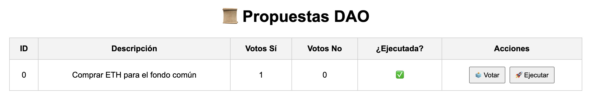

# 🤖 mi_bot_dao — CriptoBot con DAO Simulada

Bot inteligente que analiza el mercado cripto (Bitcoin y Ethereum), toma decisiones automatizadas y se conecta a una DAO local en Ganache para crear, votar y ejecutar propuestas.

---

## 🚀 Funcionalidades

- 📈 Analiza precios actuales y promedios móviles (SMA)
- 🧠 Detecta señales de compra o sobrevaloración
- 🗳️ Envía propuestas a una DAO inteligente desplegada en Solidity
- ✅ Vota automáticamente y ejecuta propuestas aprobadas
- 🌐 Interfaz web con Flask para visualizar historial y propuestas
- 📊 Guarda decisiones en `historial_bot.csv`

---

## 🧩 Tecnologías utilizadas

- Python 3
- Solidity (Smart Contracts)
- Flask (interfaz web)
- Web3.py
- Ganache (blockchain local)
- CoinGecko API

---

## 🖥️ Estructura del proyecto

mi_bot_dao/
├── bot.py # Bot principal
├── webapp.py # Interfaz Flask
├── deploy.py # Despliegue del contrato
├── interact.py # Interacción con la DAO
├── SimpleDAO.sol # Contrato inteligente básico
├── requirements.txt # Dependencias Python
├── README.md # Este archivo
└── templates/
└── index.html # Interfaz web

yaml
Copiar
Editar

---

## ⚙️ Requisitos

- Python 3.8 o superior
- Ganache en ejecución en http://127.0.0.1:7545
- MetaMask con cuenta de Ganache importada
- Archivo `.env` con tu clave privada (nunca subir):

PRIVATE_KEY=0xTU_CLAVE_PRIVADA

yaml
Copiar
Editar

---

## ▶️ Cómo ejecutar

1. Instala las dependencias:

```bash
pip install -r requirements.txt
Ejecuta el bot:

bash
Copiar
Editar
python3 bot.py
Ejecuta la interfaz web:

bash
Copiar
Editar
python3 webapp.py
Y abre: http://localhost:5001

📷 Vista del sistema


Esta imagen muestra el historial de decisiones del bot y la interacción con la DAO simulada en local.

🧪 Modo demo (local)
Este proyecto funciona íntegramente con Ganache y MetaMask, por lo que puedes probar toda la lógica DAO sin usar tokens reales. Las decisiones del bot se registran en tiempo real y se reflejan en la web.

🔒 Seguridad
No se suben claves privadas (se almacenan en .env)

.env está protegido en .gitignore

El historial Git ha sido limpiado para eliminar cualquier clave previa

🛠️ Futuras mejoras
Conexión a testnet (Goerli, Sepolia)

Gobernanza avanzada: tiempo de votación, quórum, delegaciones

Análisis de sentimiento social (Twitter, Reddit)

Panel web con más estadísticas

📄 Licencia
MIT — libre para usar, modificar y compartir.

yaml
Copiar
Editar

---

## ✅ Qué hacer ahora

1. 📁 Sube este archivo como `README.md` al repositorio
2. 📸 Asegúrate de que `captura.png` está en la raíz del repo (misma carpeta que `README.md`)
3. 🔄 GitHub mostrará automáticamente la vista previa
4. 📣 Y si quieres: te preparo ahora un texto para compartir en LinkedIn o redes tu primer MVP DAO cripto 🤖

¿Quieres que prepare eso también?


Tú dijiste:
me puedes decir donde esta la linea de captura?


ChatGPT Plus
Sí, claro. La línea que incluye la imagen captura.png está aquí, en la sección ## 📷 Vista del sistema del README.md.

Aquí está la línea exacta:

markdown
Copiar
Editar

Esta línea le dice a GitHub que muestre la imagen captura.png (que debe estar en la misma carpeta que el README.md, es decir, en la raíz del repositorio).

Justo debajo, hay una pequeña descripción:

markdown
Copiar
Editar
> Esta imagen muestra el historial de decisiones del bot y la interacción con la DAO simulada en local.

