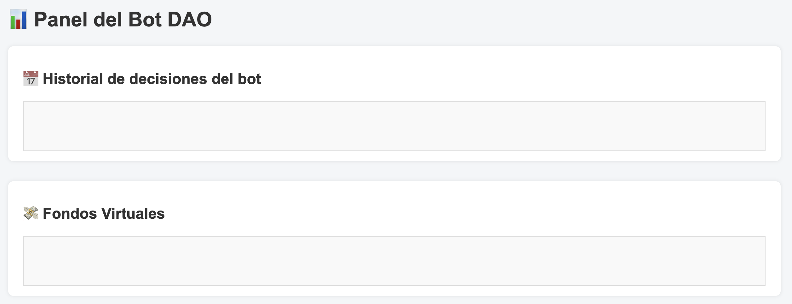

# 🤖 mi_bot_dao — CriptoBot con DAO Simulada

Bot inteligente que analiza el mercado cripto (Bitcoin y Ethereum), toma decisiones automatizadas y se conecta a una DAO local en Ganache para crear, votar y ejecutar propuestas.

---

## 🚀 Funcionalidades

- 📈 Analiza precios actuales y promedios móviles (SMA)
- 🧠 Detecta señales de compra o sobrevaloración
- 🗳️ Envía propuestas a una DAO inteligente desplegada en Solidity
- 🧾 Vota automáticamente y ejecuta propuestas si son aprobadas
- 🌐 Interfaz web con Flask para visualizar historial y propuestas
- 📊 Guarda decisiones en `historial_bot.csv`

---

## 🧩 Tecnologías utilizadas

- Python 3
- Solidity (Smart Contracts)
- Flask (interfaz web)
- Web3.py
- Ganache (blockchain local)
- CoinGecko API

---

## 🖥️ Estructura del proyecto

mi_bot_dao/
├── bot.py # Bot principal
├── webapp.py # Interfaz Flask
├── deploy.py # Despliegue del contrato
├── interact.py # Interacción con la DAO
├── SimpleDAO.sol # Contrato inteligente básico
├── requirements.txt # Dependencias Python
├── README.md # Este archivo
└── templates/
└── index.html # Interfaz web


---

## ⚙️ Requisitos

- Python 3.8 o superior
- Ganache en ejecución en http://127.0.0.1:7545
- MetaMask con cuenta de Ganache importada
- Archivo `.env` con tu clave privada (nunca subir):


---

## ▶️ Cómo ejecutar

1. Instala las dependencias:

```bash
pip install -r requirements.txt


python3 bot.py

python3 webapp.py

## 📷 Vista del sistema



🔒 Seguridad
No se suben claves privadas (se almacenan en .env)

.env está protegido en .gitignore

El historial Git ha sido limpiado para eliminar cualquier clave previa

🛠️ Futuras mejoras
Conexión a testnet (Goerli, Sepolia)

Gobernanza avanzada: tiempo de votación, quórum, delegaciones

Análisis de sentimiento social (Twitter, Reddit)

Panel web con más estadísticas

📄 Licencia
MIT — libre para usar, modificar y compartir.


Esta imagen muestra el historial de decisiones del bot y la interacción con la DAO simulada en local.

